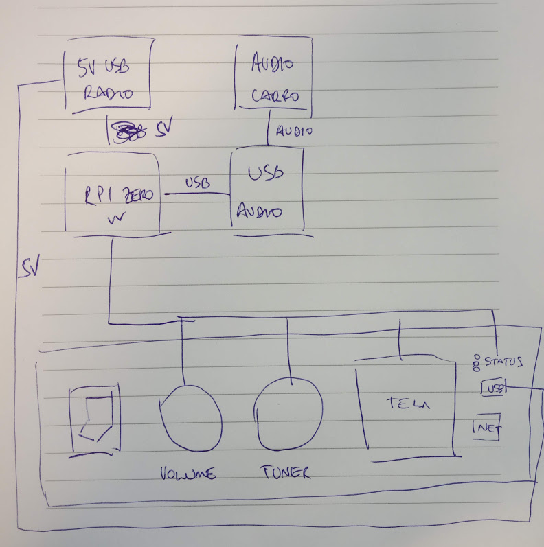

# podcastradio
A car radio that plays podcasts, using Raspberry Pi Zero.

# v1

Shopping list:

- Devices
  - ~Raspberry Pi Zero~
  - USB audio card
  - USB hub
  - Wi-fi dongle
  - USB A to micro B
  - USB A to anything
- Components
  - Power switch
  - 2 infinite knobs
  - 4? pushbuttons (or some kind of switch)
  - ~screen~
  - ~status leds~
  - USB input A
  - RJ45 input

# v2

